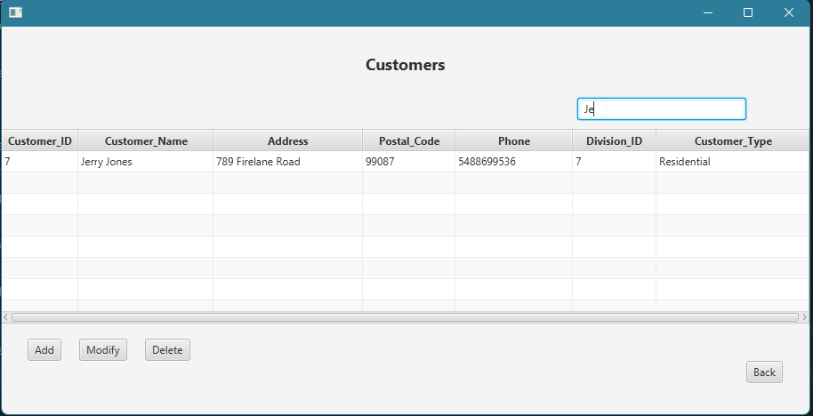
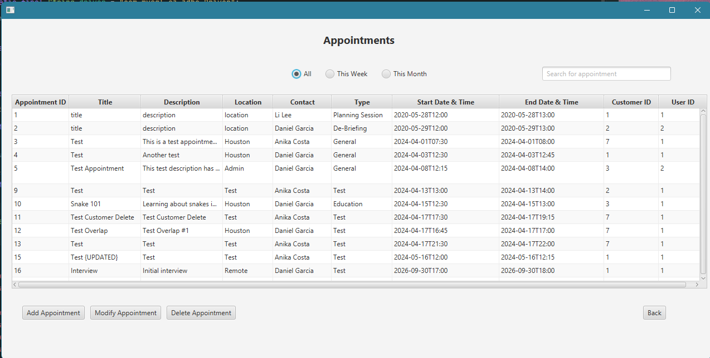
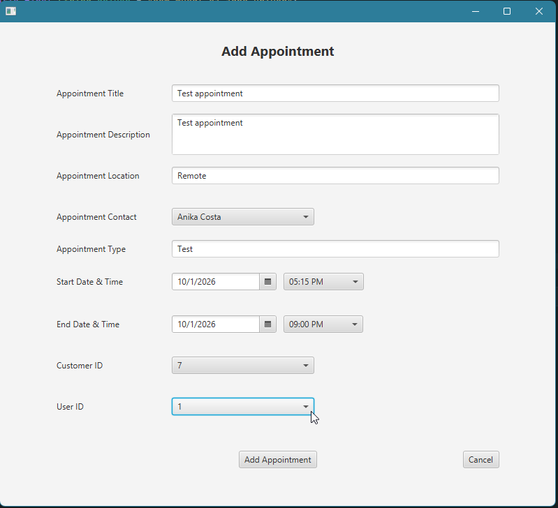
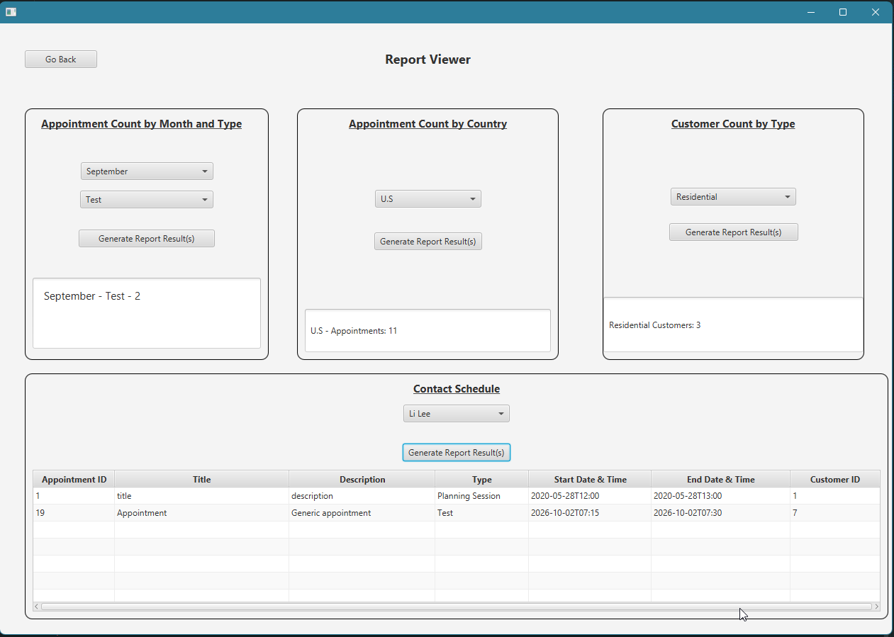

# Appointment Scheduler

A desktop application built with Java, JavaFX, and MySQL for managing customer information and scheduling appointments. Users can add, modify, or delete customer and appointment records and view pre-built reports. 

*Customer Management View*

*Appointment Management View*

## Features
- Login screen that detects the user's locale and displays French text when a French locale is detected. 
- Separate screen to view and filter customer and appointment data. 
- The ability to add a new customer to the database specifying if they are a residential or commercial customer. 
- The ability to add a new appointment, associate the appointment with a customer's ID, and select the appropriate internal contact for the appointment. 
	- If the customer has an overlapping appointment, an error will appear and prevent the appointment from being added. 
- A dedicated page with the following reports: Appointment count by month and type, appointment by country, customer count by type (commercial or residential), and appointment schedule by contact. 
- Displays any upcoming appointments associated with the signed-in user.

*Creating an appointment and associating it with a customer/contact*

*Reporting Screen*

## Technologies 
- Java
- JavaFX 
- MySQL 

## Technical Details

### Database Integration 
The application connects to a MySQL database using JDBC. SQL queries are used to retrieve and modify customer and appointment data.

### Dynamic Filtering
Dynamic filtering is used on both the customer and appointment screens. Customer and appointment records can be dynamically filtered across the displayed table as the user searches. 

### Time Zone Handling
Appointment times are stored in UTC and converted to the user's local time zone when displayed in the application. 

## Program Information
Author: 
Brandi Davis

Application Version and Date: 
Version 1.0 - 05/09/2024
Version 1.1 - 06/30/2024

IDE: 
IntelliJ Community 2023.1.5

JDK Version: 
Java SE 17.0.8

JavaFX Version: 
JavaFX-SDK-17.0.6

MySQL Connector Driver Version: 
mysql-connector-java-8.0.22

## What I Learned
This application taught me how to structure a bigger application to make sure all parts communicate. This was my first time creating an application that connects to a database, so I learned how to set up that connection and manipulate the database through code. 

## Acknowledgements
This project was originally developed as part of my Software Development coursework at Western Governors University. It has been expanded and was used as my capstone project. 

